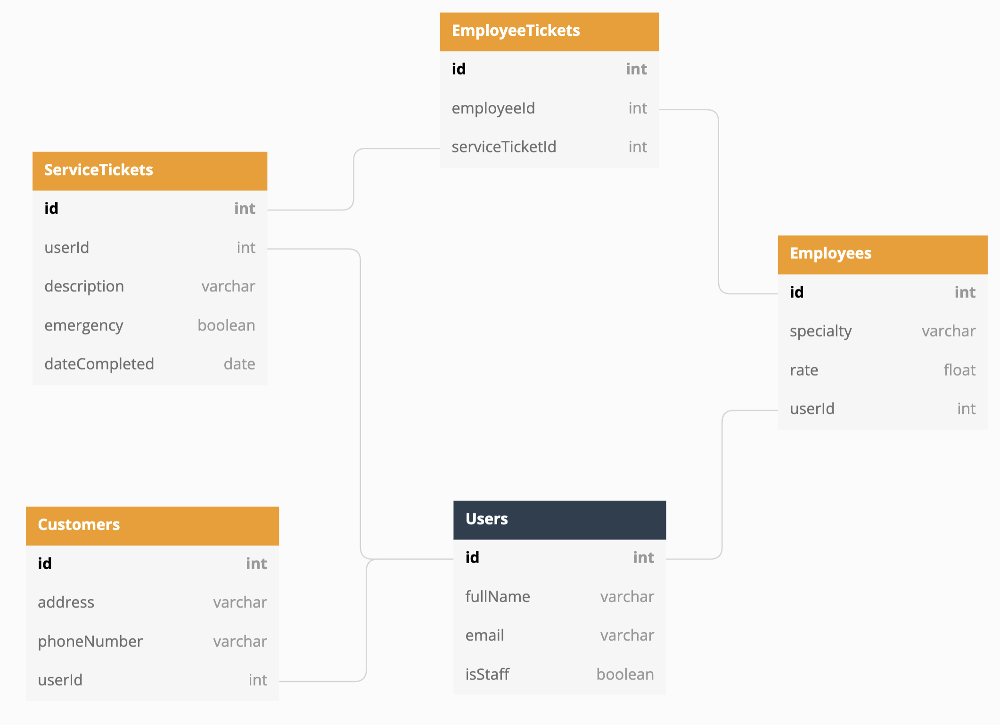

# Honey Rae's API

This chapter provides information, and the data needed, for the API that will be the permanent state for Honey Rae's Tech Repair application. As we build this application, bit by bit, we will slowly introduce more of the data into our app, starting with the service tickets. 

## ERD



### Explanation of Data and Relationships

Watch the [Honey Rae Client Side ERD](https://watch.screencastify.com/v/kZGoJhLMtuVFRjkrVm47) video for an explanation about the structure and relationships defined in the ERD.


### Copy of the ERD

Copy the code for the ERD below and paste it into dbdiagram to get your own copy of the ERD.

<details>
  <summary>Expand to the your ERD tables</summary>

  ```sql
  table serviceTickets {
    id int pk
    userId int
    description varchar
    emergency boolean
    dateCompleted date
  }

  table customers {
    id int pk
    address varchar
    phoneNumber varchar
    userId int
  }

  table employeeTickets {
    id int pk
    employeeId int
    serviceTicketId int
  }

  table employees {
    id int pk
    specialty varchar
    rate float
    userId int
  }

  table users {
    id int pk
    fullName varchar
    email varchar
    isStaff boolean
  }

  Ref: "serviceTickets"."id" < "employeeTickets"."serviceTicketId"

  Ref: "employees"."id" < "employeeTickets"."employeeId"

  Ref: "users"."id" < "employees"."userId"

  Ref: "users"."id" < "customers"."userId"

  Ref: "users"."id" < "serviceTickets"."userId"
  ```
</details>

## Getting Started

Before you start building your React application, you need a database to persist the data for it. Please follow these steps to get it set up.

```sh
cd ~/workspace
mkdir honey-raes-api
cd honey-raes-api
touch database.json
```

Then copy the following JSON into the `database.json` file.

<details>
    <summary>Expand to get your data</summary>

```json
{
  "users": [
    {
      "id": 1,
      "fullName": "Dion Stoade",
      "email": "dstoade0@cornell.edu",
      "isStaff": false
    },
    {
      "id": 2,
      "fullName": "Windy Thorneloe",
      "email": "wthorneloe1@usa.gov",
      "isStaff": false
    },
    {
      "id": 3,
      "fullName": "Hillie Phillpotts",
      "email": "hphillpotts2@rakuten.co.jp",
      "isStaff": false
    },
    {
      "id": 4,
      "fullName": "Helenelizabeth Passfield",
      "email": "hpassfield7@netvibes.com",
      "isStaff": true
    },
    {
      "id": 5,
      "fullName": "Franchot Slator",
      "email": "fslator8@51.la",
      "isStaff": true
    },
    {
      "id": 6,
      "fullName": "Renaud Erbe",
      "email": "rerbe9@psu.edu",
      "isStaff": true
    },
    {
      "email": "jeremy@bakker.com",
      "fullName": "Jeremy Bakker",
      "isStaff": true,
      "id": 7
    }
  ],
  "customers": [
    {
      "id": 1,
      "address": "2802 Zula Locks",
      "phoneNumber": "852-837-9713",
      "userId": 2
    },
    {
      "id": 2,
      "address": "568 Fadel Gateway",
      "phoneNumber": "202-244-7090",
      "userId": 1
    },
    {
      "id": 3,
      "address": "161 Wessington Place",
      "phoneNumber": "865-266-0357",
      "userId": 3
    }
  ],
  "employees": [
    {
      "id": 1,
      "specialty": "Macbook Pros",
      "rate": "100",
      "userId": 4
    },
    {
      "id": 2,
      "specialty": "Apple Repair",
      "rate": 97.39,
      "userId": 5
    },
    {
      "id": 3,
      "specialty": "Printer Repair",
      "rate": 29.45,
      "userId": 6
    }
  ],
  "serviceTickets": [
    {
      "id": 1,
      "userId": 3,
      "description": "Cracked phone screen",
      "emergency": false,
      "dateCompleted": "Fri Apr 29 2022 14:02:20 GMT-0500 (Central Daylight Time)"
    },
    {
      "id": 2,
      "userId": 3,
      "description": "Xbox has red ring of death",
      "emergency": true,
      "dateCompleted": ""
    },
    {
      "id": 3,
      "userId": 2,
      "description": "Dropped iPhone in toilet",
      "emergency": true,
      "dateCompleted": "2023-08-12T03:06:27.975Z"
    },
    {
      "userId": 1,
      "description": "Desktop wont turn on",
      "emergency": false,
      "dateCompleted": "",
      "id": 4
    },
    {
      "userId": 3,
      "description": "Speaker phone does not work on iPhone",
      "emergency": true,
      "dateCompleted": "",
      "id": 5
    },
    {
      "id": 6,
      "userId": 2,
      "description": "Airpods wont connect",
      "emergency": false,
      "dateCompleted": ""
    },
    {
      "userId": 2,
      "description": "Router is broken",
      "emergency": true,
      "dateCompleted": "",
      "id": 7
    }
  ],
  "employeeTickets": [
    {
      "id": 1,
      "employeeId": 3,
      "serviceTicketId": 1
    },
    {
      "id": 3,
      "employeeId": 1,
      "serviceTicketId": 4
    },
    {
      "employeeId": 2,
      "serviceTicketId": 2,
      "id": 4
    },
    {
      "employeeId": 2,
      "serviceTicketId": 7,
      "id": 6
    }
  ]
}
```
</details>

Every time you want to work on your application, you'll need to ensure that the API is running. Open a new terminal and start it.

```sh
json-server -p 8088 database.json
```

Feel free to make more of each resource if you want to see more data in your API.

| <h1>&#x2757;</h1> | _The [vscode-faker](https://marketplace.visualstudio.com/items?itemName=deerawan.vscode-faker) extension for Visual Studio Code or [ChatGPT](https://chat.openai.com/auth/login) are fast, easy ways to generate starter data._ |
| --- | --- |
## Backup to Github

Make sure you create a repository on your Github account for your API, and hook up the `honey-raes-api` directory. Yes, there's only one file being tracked in this repository, and that's ok.

Up Next: [Repair WireFrame](./REPAIR_WIREFRAME.md)