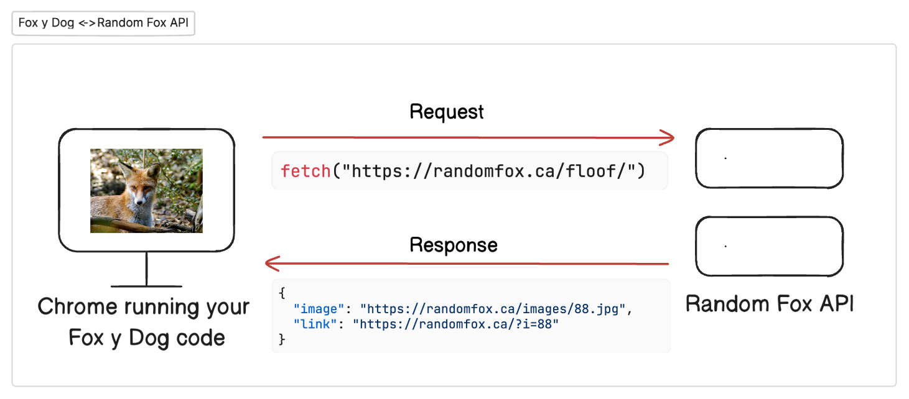

# Using Fetch and Monitoring Network Requests

## Introduction to Fetch

Now that we understand what APIs are and have tested them using Yaak, it's time to interact with these APIs directly from our JavaScript code. We'll use the built-in `fetch()` function to make requests to our animal APIs.

### What is Fetch?

The `fetch()` function is a built-in JavaScript method that allows us to make network requests to servers and APIs. It's the foundation of client-side API communication in modern web applications.

Think of fetch as your web browser's way of "reaching out" across the internet to grab data from another computer (server).

### How Fetch Works:

1. Your JavaScript code calls the `fetch()` function with a URL as a argument
2. The browser sends an HTTP request to that URL
3. The server processes the request and sends back a response
4. Your code can then use the data from the response



## Writing Your First Fetch Call

Let's start by writing a simple fetch call to the Random Fox API we explored earlier. In our application, when the user clicks the **Get Fox** button, we want to get a random fox image using the randomfox api. Take a look at `main.js`. There are two click events there, one for the fox button and one for the dog button. Add the following line of code to your `main.js` file to run when the fox button is clicked. 

```js
fetch("https://randomfox.ca/floof/")
```

>💡 The `fetch()` function makes a GET request by default. This means unless specified in an optional second argument, this function will use the GET method instead of POST, PUT, or DELETE. We'll learn more about this in the next column.

Run the `serve` command in your terminal and let's take a look at the browser. 

Wow. Exciting stuff. Wait... what should we be seeing here? Well, nothing on the page yet. Patience young one. First we want to check out what response we got from this fetch call before we start writing code to display the fox image in the DOM. 

## Monitoring Fetch Requests in the Browser

One of the most powerful tools for understanding and debugging API calls is the Network tab in your browser's Developer Tools. This allows you to see exactly what's happening "under the hood" when your code makes a fetch request.

### Opening the Network Tab

1. Open the devtools 
2. Click on the "Network" tab in the developer tools panel
3. Make sure the "All" or "Fetch/XHR" filter is selected
    >✔️ *While you're at it, go ahead and check that "Disable cache" box - this often gets in the way in later chapters in this course*
4. Click on the 🚫 button in top left-hand corner to clear out the display so it's not so noisy. 

### Making a Fetch Request and Monitoring It

With the Network tab open:

1. Click on the "Get Fox" button
2. Watch the Network tab - you'll see a new entry appear
3. The entry's name will be "floof/" (the endpoint of the Random Fox API)
4. The "Method" column will show GET - we made a GET request to this endpoint.
5. The "Status" column should show "200" (meaning the request was successful)
6. The "Type" column will show "fetch" or "xhr" (depending on the browser)


### Understanding the Network Tab Information

Click on the "floof/" entry in the Network tab to see detailed information about the request and response. These are the parts we want you to pay attention to in this course:

#### Headers Tab
This tab shows important metadata about the request and response:

- **General**:
  - Request URL: The full URL that was requested
  - Request Method: GET (in this case)
  - Status Code: 200 OK (for a successful request)


#### Preview/Response Tab
This tab shows the actual data returned by the server:

- **Preview**: A nicely formatted view of the JSON data
- **Response**: The raw response text


## Testing Error Scenarios

In `main.js` change the URL passed to the fetch function to `"https://randomfox.ca/flop/"`. Flop is a nonexistent endpoint for the randomfox api. Save and refresh and let's go see what happens when we click on that **Get Fox** button now...

1. You should see a request appear with a red color (indicating an error), the endpoint says "flop/"
2. The status code is now "404" (meaning the request was unsuccessful, the resource was not found) 
3. In the console, you might see an error message

This demonstrates how to identify network errors in your fetch requests - a critical skill for building reliable applications.

## 🎓 Practice Exercise: Experimenting with Fetch Calls

Now it's your turn to practice! Make a fetch call to the [random dog api](./FD_INTRO_TO_API.md#-introducing-fun-image-apis) when the user clicks on the **Get Dog** button.

1. Use the Network tab to observe the request and response
2. Take notes on:
   - The HTTP status code of the response
   - What headers are included in the response
   - What the response data looks like in the Preview tab

## What We've Learned

In this chapter, we've:
- Learned what the javascript fetch function is and how to make basic requests
- Used JavaScript to send fetch requests to external APIs
- Used the Network tab to monitor and inspect HTTP requests and responses
- Examined the structure of HTTP responses including headers and response data
- Identified different two HTTP status codes and what they mean

## Next Steps

In the upcoming chapters, we'll learn how to:
- Work with the data that comes back from a fetch request
- Display the images we receive from the animal APIs on our webpage

Up Next: ["Then" We Display](./FD_INTRO_TO_THEN.md)