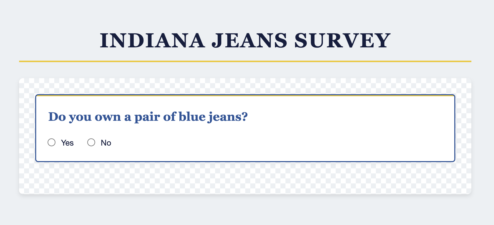

# Creating a Radio Button Component

> ⚠️ **IMPORTANT NOTE BEFORE YOU BEGIN:** In the chapters of this column, much of the code will be provided for you. It's very easy to copy and paste the code snippets, however this is not recommended as it does not produce understanding or retention. We encourage you to type out the code, or at the very least read the code line by line. This way you think about what the code snippet actually does as you add it to your project.

## Building Projects Using Components

In the previous chapter, we set up our database and tested our API using Yaak. Now we're ready to start building the user interface for our survey application.

For this project, we'll be using the same component-based approach you've been using since Book 3. 

>💡 A **component** is a reusable piece of code that represents a part of your user interface. Breaking our application into components makes our code more organized and easier to maintain.

## Radio Buttons for User Choices

Our survey needs to collect information about whether students own blue jeans. For this kind of yes/no question, radio buttons are the perfect form element to use.

Radio buttons allow users to select exactly one option from a set of choices. When one option is selected, any previously selected option becomes deselected automatically, as long as we've given the inputs the same name attribute. 

## Creating the JeanChoices Component

Let's create our first component for the jeans ownership question:

1. Create a new file named `JeanChoices.js` in your `scripts` directory.
2. Add the following code to the file:

```javascript
export const JeanChoices = () => {
    let html = `
        <div class="survey-input">
            <h2>Do you own a pair of blue jeans?</h2>
            <input type="radio" name="ownsJeans" value="true" /> Yes
            <input type="radio" name="ownsJeans" value="false" /> No
        </div>
    `

    return html
}
```

Let's break down this component:

- Inside the component, we create:
  - A container `<div>` with class `survey-input` for styling
  - A heading that asks the survey question
  - Two radio buttons with the same `name` attribute (ensuring only one can be selected)
  - Values of "true" and "false" for the yes/no options

Some important things to note about radio buttons:

1. Radio buttons with the same `name` attribute form a group. Only one button in a group can be selected at a time.
2. Each radio button needs a unique `value` attribute that will be submitted when the form is processed.
3. We're using string values "true" and "false" here, but we'll convert them to actual boolean values later.

## Updating the Main Module

Now that we've created our component, let's import it and add it to our page:

1. Open `main.js` in your `scripts` directory.
2. Add the following code:

```javascript
import { JeanChoices } from "./JeanChoices.js"

const container = document.querySelector("#container")

const render = () => {
    const jeansHTML = JeanChoices()
    
    container.innerHTML = `
        ${jeansHTML}
    `
}

render()
```

Let's review what this code does:

- We import the `JeanChoices` component from its module
- We get a reference to the container element in our HTML
- We define a `render()` function that:
  - Calls our `JeanChoices()` function to get the HTML
  - Updates the container's innerHTML with the generated HTML
- Finally, we call `render()` to display our component when the page loads

## Testing Our Component

Now it's time to see our work in action!

1. Make sure your JSON server is still running (if not, start it with `json-server -p 8088 -w api/database.json`)
2. Start your web server (run `serve` in your project directory)
3. Open your browser to the local server URL (usually http://localhost:3000)

You should see:
- A heading "Indiana Jeans Survey" (from your HTML file)
- A question "Do you own a pair of blue jeans?"
- Two radio buttons for "Yes" and "No"



Try clicking the radio buttons. Notice how selecting one automatically deselects the other. This is the default behavior of radio buttons with the same name attribute.

## Component Reusability Advantage

One key advantage of using components is reusability. If we needed to ask the same question in multiple places, we could simply call the `JeanChoices()` function again rather than duplicating the HTML.

Components also make code maintenance easier. If we need to change the question, we only need to update it in one place, regardless of how many times it appears in our application.

## 🎓 Practice Exercise: Maybe I Have Jeans...

Try modifying the `JeanChoices` component to add an additional "Maybe" option (although we won't use this in our final application).

Remember that changes to any JavaScript file will be automatically detected by the server, but you may need to refresh your browser to see the updates.

## 📝 What We've Learned

In this chapter, we've:
- Created our first component (JeanChoices) for the survey application
- Learned how to structure radio buttons for yes/no user input
- Set up the main render function to display our component
- Observed how radio buttons with the same "name" attribute work as a group

## 🔜 Next Steps

Although our radio buttons display correctly, they don't actually do anything yet when clicked. We'll get to that in a later chapter. In the next chapter, we'll create another component for location choices, this time the choice options will come from our database. 

Up Next: [Location Component](./IJ_LOCATION_COMPONENT.md)